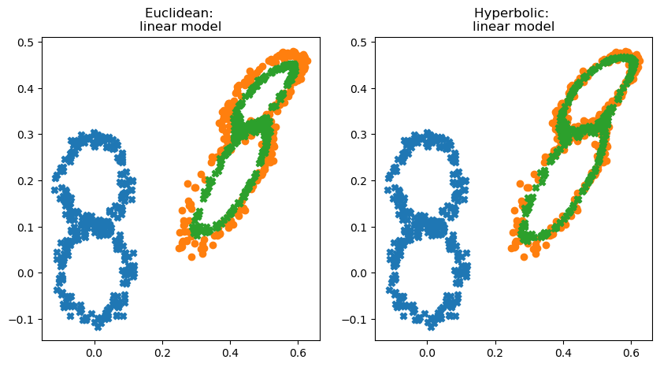
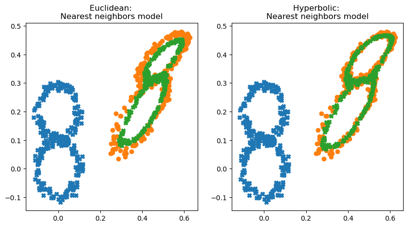
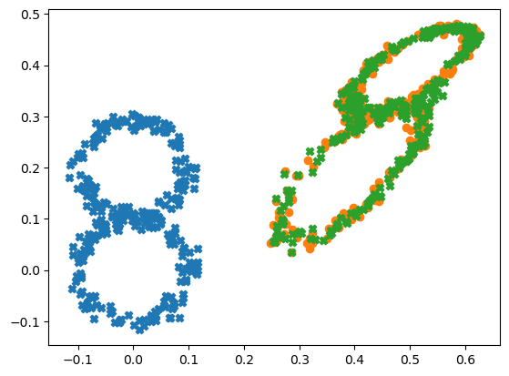
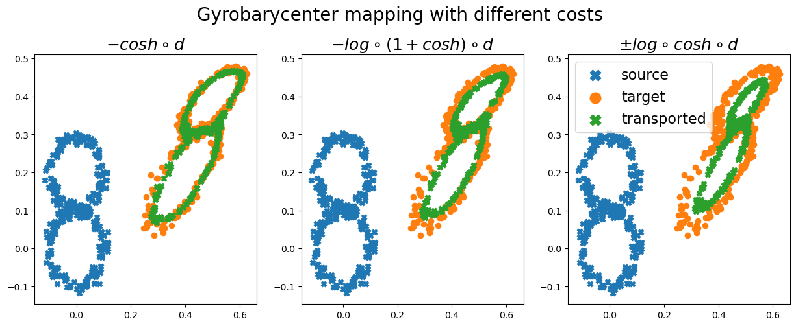

# hyperbolic_alignment
This repo contains a base implementation for [aligning hyperbolic representations using an Optimal Transport-based approach](http://arxiv.org/abs/2012.01089).


# Examples: Hyperbolic/Euclidean Mapping Estimation 

This code is written in Python and relies on Anaconda to create an environment to install dependencies.

## Installing the anaconda environment.

All associated packages are opensource. The file environment.yml contains all the packages used in the examples. 

To install these packages run
```
make install
```

## Installing the anaconda environment.

It contains two examples, one for each use case. 

### Barycenter of shapes: interpolation of clounds of points

```
make run_example
```

----
## Linear and wrapped linear mapping


## OT-DA


## Hyp-ME



### Gyrobarycenter with various costs


----
This code is going to be shared in a Github repository after receiving the conference decision.